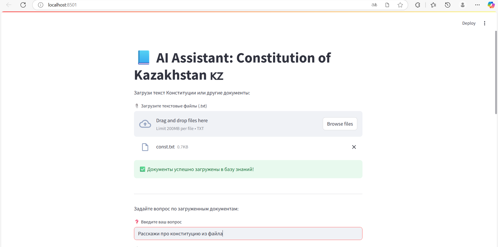
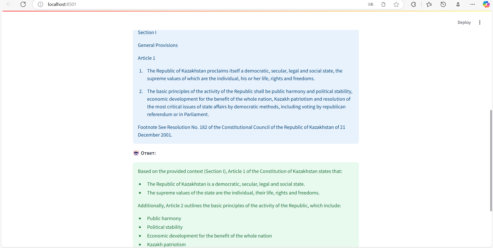

# 🇿🇦 AI Assistant: Constitution of the Republic of Kazakhstan

🤖 Приложение на базе **Ollama**, **ChromaDB** и **Streamlit**, которое позволяет задавать вопросы по Конституции РК или другим загруженным документам.

---

## 📸 Превью

| Загрузка файлов              | Ответ на вопрос                  |
| ---------------------------- | -------------------------------- |
|  |  |

> 📂 Помести свои изображения в папку `images/` и измени названия в таблице при необходимости.

---

## ✨ Быстрый старт

### 1. Запуск Ollama (Docker)

```bash
docker run -d --name ollama -p 11434:11434 ollama/ollama
docker exec -it ollama ollama run llama3
```

### 2. Установка зависимостей Python

```bash
pip install streamlit langchain chromadb langchain-community
```

### 3. Запуск Streamlit-приложения

```bash
streamlit run main.py
```

---

## 📂 Возможности

* ✅ Загрузка одного или нескольких `.txt` документов
* ✅ Индексация содержимого в ChromaDB
* ✅ Задание вопросов к содержимому документов
* ✅ Ответы от LLM через Ollama
* ✅ Интерфейс Streamlit

---

## 🧐 Используемые технологии

* [Ollama](https://ollama.com/) — локальное LLM-ядро (`llama3`)
* [LangChain](https://www.langchain.com/)
* [ChromaDB](https://www.trychroma.com/)
* [Streamlit](https://streamlit.io/)

---

## 📁 Структура проекта

```
project/
├── main.py            # Основное приложение
├── chroma_db/         # Векторное хранилище
├── images/            # Скриншоты интерфейса
└── README.md
```

---


---
